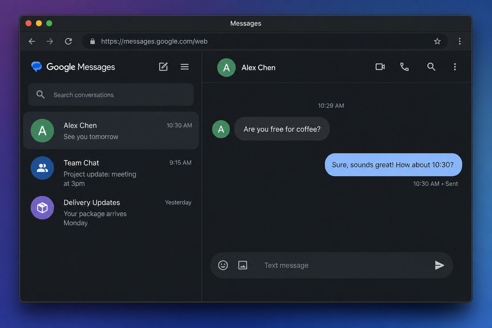
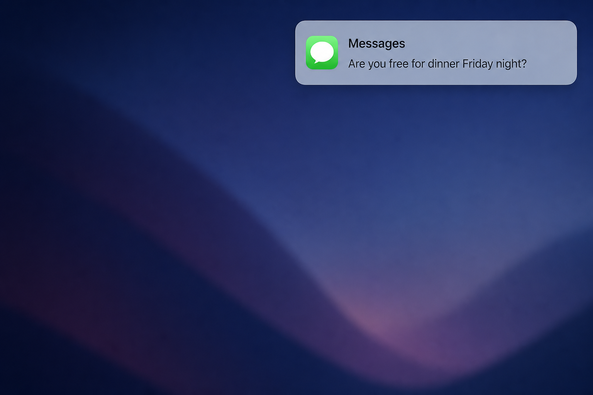
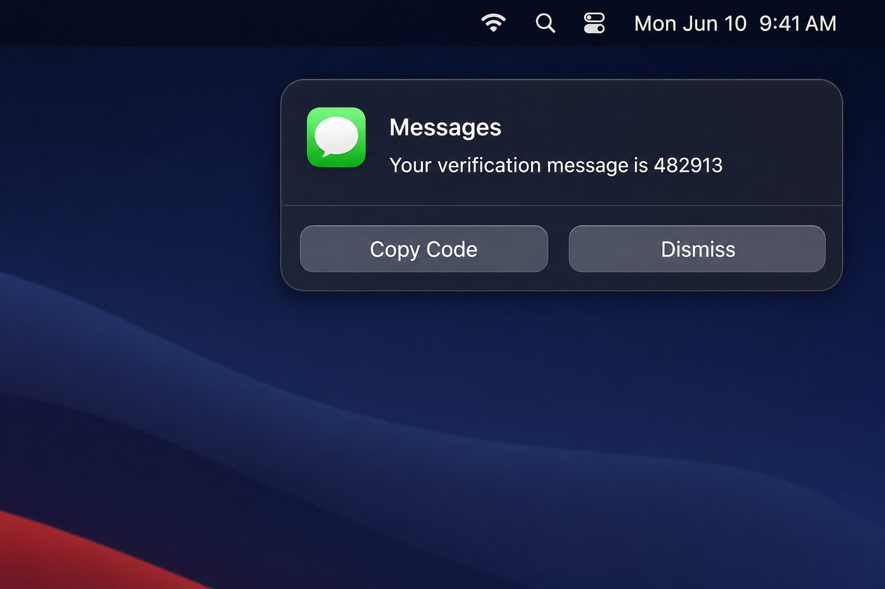

# Messages

Unofficial [Google Messages](https://messages.google.com/web/) desktop client for macOS with native Notification Center alerts, **background quick reply**, **Copy Code** for verification texts, and quick navigation to the right conversation.

Forked from [Alyetama/Google-Messages-Desktop](https://github.com/Alyetama/Google-Messages-Desktop).

## Screenshots

### Desktop app

Google Messages for Web in a dedicated window. Runs in the background when you close it — notifications keep working.



### Regular message notification

Regular texts show the **contact name** (or phone number if the contact is not saved) as the title, with the message preview below. Reply inline from Notification Center without opening the app. Multiple texts from the same contact are grouped into one alert. Click the notification to open that conversation (no full page reload).



### Verification code notification

Verification texts show the **extracted code** as the body (not the full SMS). **Copy Code** copies the digits, marks the thread read in the background, and dismisses the alert. No reply field on code messages. Codes auto-clear after 5 minutes if ignored.



## Download

Get the latest release:

| Chip | File |
|------|------|
| Apple Silicon (M1/M2/M3/M4) | `Messages-1.6.1-arm64.dmg` |
| Intel | `Messages-1.6.1-x64.dmg` |

Releases: [github.com/perlytiara/Google-Messages-Desktop-macOS/releases](https://github.com/perlytiara/Google-Messages-Desktop-macOS/releases)

### Install

1. Download the `.dmg` for your Mac.
2. Drag **Messages** to Applications.
3. First launch: right-click → **Open** if macOS warns about an unsigned developer.
4. Sign in to Google Messages and allow notifications when prompted.
5. For verification codes, set **System Settings → Notifications → Messages → Alerts** so **Copy Code** stays visible. Regular messages work fine as banners.

### Upgrade from an older build

If you installed a previous version manually, quit Messages and replace the app in `/Applications`, or run from a clone:

```bash
npm run install:app
```

That rebuilds, installs to `/Applications/Messages.app`, and relaunches.

## Features

- Google Messages for Web in a native desktop window.
- Background operation — close the window (red X) and keep receiving texts.
- Native macOS notifications synced from your paired phone.
- **Background quick reply** — reply from Notification Center without the app stealing focus.
- **Contact name or number** as the notification title (no extra app label in the banner).
- Notifications grouped **by contact** (one alert per person, updated as new texts arrive).
- **Regular messages** — inline **Reply**, **Mark Read**, and **Dismiss**.
- **Verification / bank codes** — extracted code as the notification body; **Copy Code** (copy + mark read + dismiss) or **Dismiss**; no reply on code messages.
- **Mark read in place** — marking from a notification does not leave you on a different conversation; focus returns to the app you were using.
- Opens the correct conversation via in-app navigation (no full reload).
- **Multi-locale OTP detection** — English, French, Spanish, German, Italian, Portuguese (e.g. BoursoBank `le code est …`, Google `G-123456`).
- **Persistent message baseline** — restarts do not re-notify for old conversations.
- **Single-instance app** — no duplicate Messages icons in the Dock.
- **Incoming-only notifications** — messages you send (including quick replies) no longer trigger a second banner that looks like it came from the contact.
- Optional developer tools for testing SMS via Twilio (credentials stay local).
- **Automatic updates** — downloads in the background from GitHub Releases, shows native progress, restart to install.

## Automatic updates

Messages checks GitHub Releases for updates when the app starts and every 6 hours.

1. A new version downloads **in the background** while you keep using the app.
2. A native progress window and Dock badge show download status.
3. When ready, choose **Restart and Install**, **Install on Quit**, or **Later**.
4. Manual check anytime: **Messages → Check for Updates…**

Updates require **ZIP builds** published to [GitHub Releases](https://github.com/perlytiara/Google-Messages-Desktop-macOS/releases). CI builds DMG + ZIP on every `v*` tag.

### GitHub Actions signing secrets (recommended)

For seamless macOS updates without Gatekeeper warnings, add these repository secrets:

| Secret | Purpose |
|--------|---------|
| `CSC_LINK` | Base64-encoded `.p12` Developer ID Application certificate |
| `CSC_KEY_PASSWORD` | Certificate password |
| `APPLE_ID` | Apple ID email used for notarization |
| `APPLE_APP_SPECIFIC_PASSWORD` | App-specific password |
| `APPLE_TEAM_ID` | Apple Developer Team ID |

Push a tag (e.g. `v1.6.2`) and the [Release workflow](.github/workflows/release.yml) builds, signs, and publishes update assets automatically.

## What's new in 1.6.1

- **Automatic updates** — background download from GitHub Releases, native progress UI, restart to install.
- **Check for Updates** — new item under the Messages app menu.

## What's new in 1.6.0

- **Copy Code marks read and dismisses** — one tap copies the OTP, marks the thread read in the background, and clears the notification.
- **Mark Read action** — regular messages can be marked read from Notification Center without opening Messages.
- **Mark read in place** — background DOM updates never strand you on the wrong conversation; your previous thread is restored.
- **Copyable verification codes** — bank and OTP SMS show the extracted digits (e.g. `239159`) with context in the subtitle, not the full message text.
- **No reply on code messages** — verification alerts are copy-or-dismiss only; regular messages keep inline reply.
- **Multi-locale verification** — French (`Votre code … est:`, `le code est …`), plus Spanish, German, Italian, Portuguese patterns.
- **Testing tools** — batch notification previews (**Testing → Run Batch Test**), `npm run test:notifications`, and `npm run test:sms` for Twilio.
- **Stability fix** — crash when interacting with notifications after mark-as-read (`notificationInteractionUntil`).

## What's new in 1.5.3

- **Multi-locale verification codes** — French, Spanish, German, Italian, and Portuguese OTP patterns.
- **Testing menu** — French verification previews under **Testing → Preview Verification Formats**.

## What's new in 1.5.2

- **Fix false reply notifications** — replying from Notification Center no longer triggers a second alert that shows your contact’s name with your own message text.
- **Outgoing messages blocked by default** — only incoming texts notify.
- **Reply echo suppression** — dismisses the banner on reply and suppresses watcher echoes for that thread.

## What's new in 1.5.0

- **Background quick reply** — type a response in Notification Center; Messages sends it in the background without popping the window to the front.
- **Cleaner notification layout** — contact name as the title, message text as the body.
- **No duplicate alerts on restart** — conversation snippets saved to disk.
- **`npm run install:app`** — one command to rebuild and install to `/Applications/Messages.app`.

## Development

```bash
git clone https://github.com/perlytiara/Google-Messages-Desktop-macOS.git
cd Google-Messages-Desktop-macOS
npm install
npm start
```

### Build locally

```bash
npm run dist
```

Produces `Messages-1.6.1-arm64.dmg`, `Messages-1.6.1-x64.dmg`, and matching `.zip` files (for auto-update) in `dist/`.

Build Apple Silicon only:

```bash
npm run dist:arm64
```

Install the built app to `/Applications`:

```bash
npm run install:app
```

### Optional: test SMS via Twilio

For developers only. Credentials are stored locally and are **never** committed to git.

1. Copy `.env.example` to `~/Library/Application Support/messages/.env`, or use **Testing → Configure Test SMS Settings** in the app.
2. Add your own Twilio Account SID, Auth Token, sender ID (`TESTunit` alphanumeric or E.164 phone), and phone number.
3. Use **Testing → Send Real SMS to My Phone** or `npm run test:sms`.

### Debug logs

When troubleshooting notifications or replies:

| Log | Location |
|-----|----------|
| Incoming notifications | `~/Library/Application Support/messages/incoming-log.jsonl` |
| Notification replies | `~/Library/Application Support/messages/reply-log.jsonl` |
| Message watcher | `~/Library/Application Support/messages/watcher-debug.jsonl` |
| Snippet baseline | `~/Library/Application Support/messages/watcher-baseline.json` |

Use **Testing → Show Last Reply Debug Log** and **Testing → Run Full Notification Pipeline Test** in the app menu.

## Privacy

This app wraps Google Messages for Web. Message content is processed locally on your Mac for notifications. Optional Twilio testing stores credentials in `~/Library/Application Support/messages/` only on your machine.

## License

[MIT License](https://opensource.org/license/mit).
